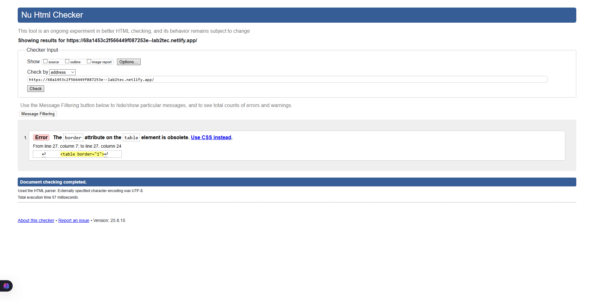
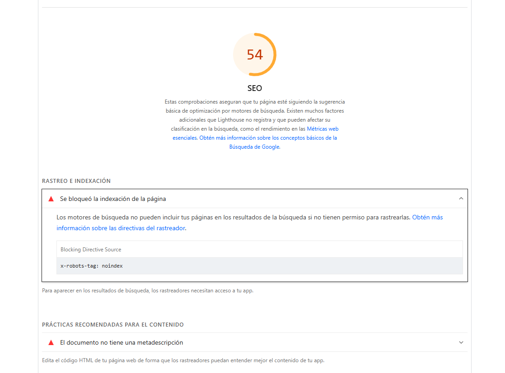

# **Laboratorio 2 – IC8057: Introducción al Desarrollo de Páginas Web**

Nombre: Josué Torres Narvaez  
Carné: 2018084162  
Curso: IC-8057 – Introducción al Desarrollo de Páginas Web  
Fecha: 16/08/2025  

---

## **Título del proyecto**

**TechFuture 2025 – Evento Tecnológico**  

Este proyecto consiste en el desarrollo de una página web estática para un evento ficticio de tecnología. El objetivo es aplicar **estructura semántica de HTML5, accesibilidad, validación y despliegue en Netlify**, siguiendo las buenas prácticas vistas en clase.

---

## **Estructura semántica aplicada**

Se utilizó una estructura completa y organizada de etiquetas HTML5 con fines semánticos y de accesibilidad:

- `<header>`: Título principal del evento y menú de navegación.  
- `<nav>`: Menú con enlaces internos a cada sección.  
- `<main>`: Contenido central del sitio.  
- `<section>`: Organización del contenido en 5 bloques principales (Agenda, Expositores, Registro, Ubicación, Patrocinadores).  
- `<article>`: Información individual de expositores.  
- `<figure>` + `<figcaption>`: Imagen con descripción asociada.  
- `<aside>`: Información adicional sobre patrocinadores.  
- `<footer>`: Información de derechos reservados.  

Además, se implementaron elementos de **contenido enriquecido**:  

- Listas ordenadas `<ol>` y no ordenadas `<ul>`.  
- Tabla `<table>` con `<thead>`, `<tbody>`.  
- Cita `<blockquote>`.  
- Formulario `<form>` con campos de texto, correo, select, checkboxes y botón de envío.  

---

## **Accesibilidad aplicada**

Para mejorar la experiencia de usuarios con diferentes capacidades se aplicaron los siguientes elementos:

- `alt` en **todas las imágenes**.  
- `tabindex="0"` en una imagen y `tabindex="-1"` en otra.  
- Uso de `<figure>` y `<figcaption>` para describir imágenes relevantes.  
- `aria-label` en el botón de envío del formulario.  
- Enlaces con **texto claro y descriptivo** (se evitó “haz clic aquí”).  

---

## **Validación y análisis**

### ✔️ W3C Validator
- El archivo `index.html` fue validado con [W3C Validator](https://validator.w3.org/).  
- **Resultado:** El documento no presentó errores graves.  
- Advertencias menores: El documento presentó un error relacionado con el atributo `border` en la tabla.  

---

### ✔️ Lighthouse
Se ejecutó una auditoría con **Lighthouse** en las categorías de **Accessibility** y **SEO**.  

- **Accesibilidad:** 96/100  
- **SEO:** 54/100 (Reporte con advertencia crítica).

**Problema detectado**

**Causa probable:**  
Netlify agrega la cabecera `x-robots-tag: noindex` en algunos despliegues (principalmente URLs temporales o sin configuración de dominio personalizado).  

**Corrección propuesta:**  

- Configurar un dominio personalizado en Netlify (o cambiar la configuración del deploy) para permitir indexación.
- Se añadió la etiqueta `<meta name="description">` en el `<head>` con un resumen claro del sitio.

---

## **Despliegue en Netlify**

El proyecto fue versionado en GitHub y desplegado en **Netlify**.  

- **Repositorio en GitHub:** [Lab2](https://github.com/JosueTorresN/Lab2.git) 
- **Sitio en Netlify:** [https://68a1453c2f566449f087253e--lab2tec.netlify.app](https://68a1453c2f566449f087253e--lab2tec.netlify.app)  

---

## **Conclusiones**

- Se logró implementar correctamente una página semántica con accesibilidad básica y contenido variado.  
- La validación en W3C y los resultados de Lighthouse demostraron que el sitio pese a pequeños errores, cumple en gran medida los estándares de calidad y accesibilidad.  
- El despliegue en Netlify permite compartir el proyecto fácilmente y garantiza integración continua con GitHub.  

---
